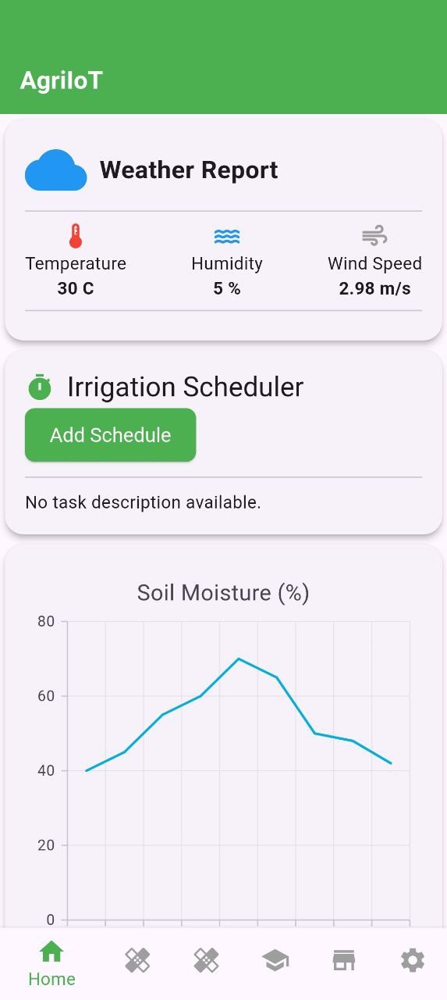
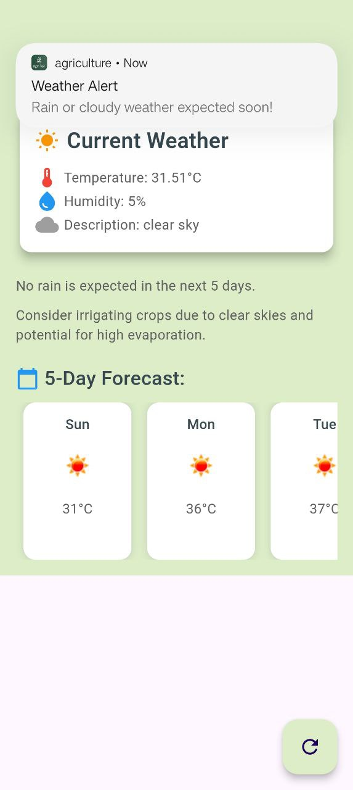
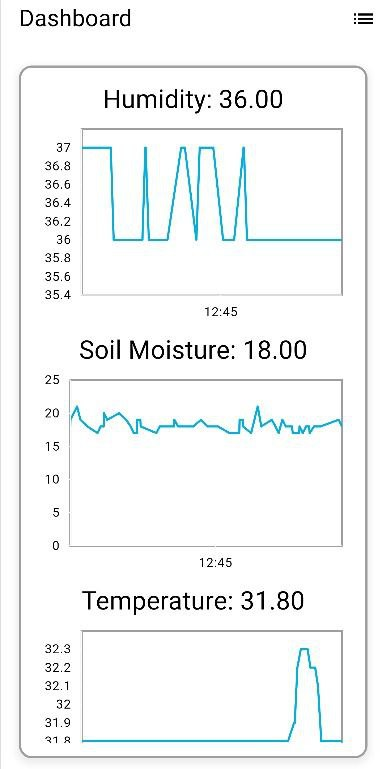
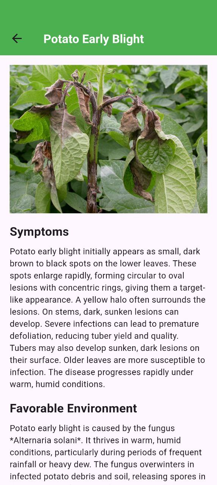
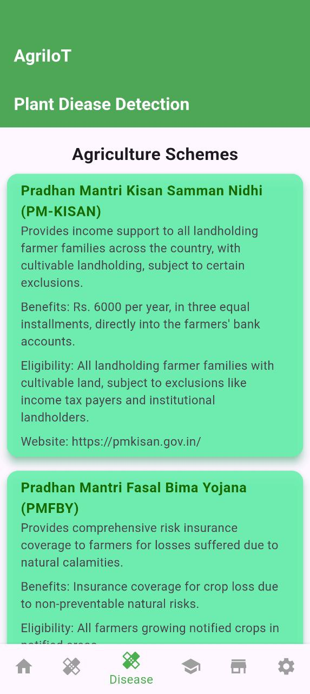
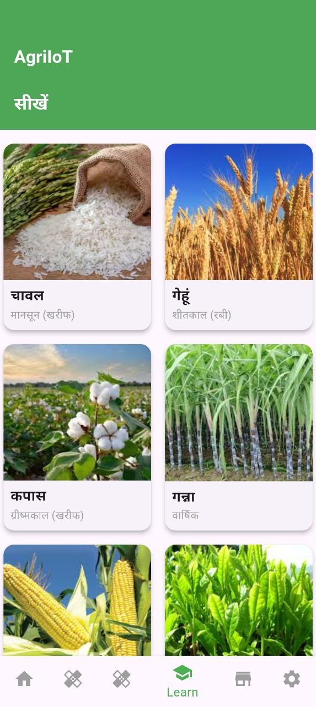
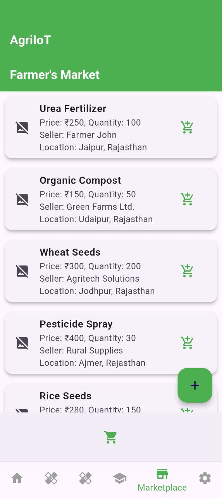

# agriculture

A new Flutter project.

## Getting Started

This project is a starting point for a Flutter application.

## App Functionality

The agriculture app offers a range of features designed to assist with agricultural activities, leveraging technology for efficient farming. Below are images showcasing the app's functionality:

  
  
  
  
  
  
  

## Features

* **Crop Details Dashboard (Home):**
    * Provides a centralized view of essential crop information, including:
        * Crop name and area.
        * Last irrigation date.
        * Soil moisture levels.
        * Temperature and humidity.
    * Allows users to initiate irrigation (if connected to IoT devices).
* **Government Schemes:**
    * Provides information about various government schemes and initiatives available to farmers, including:
        * National Mission for Sustainable Agriculture (NMSA).
        * National Food Security Mission (NFSM).
        * Rashtriya Krishi Vikas Yojana (RKVY).
        * Sub-Mission on Agricultural Mechanization (SMAM).
        * Integrated Schemes for Farmers (ISF).
        * Agriculture Technology Management Agency (ATMA).
* **Crop Disease Detection:**
    * Enables users to detect potential crop diseases through image analysis (integrates with camera or image uploads).
    * Provides diagnostic information and recommended actions.
* **Weather for Agriculture:**
    * Delivers accurate and localized weather forecasts tailored to agricultural needs.
    * Displays key weather parameters, such as:
        * Temperature.
        * Humidity.
        * Rainfall.
        * Wind speed.
* **Agriculture Education:**
    * Offers valuable educational resources and tips for small-scale farmers.
    * Covers topics like:
        * Organic fertilizer usage.
        * Crop rotation techniques.
        * Water conservation.
        * Pest management.
        * And more.
    * Provides links to further in depth educational content.
* **User-Friendly Interface:**
    * Intuitive and easy-to-navigate design.
    * Bottom navigation bar for quick access to key features.

## Target Audience

* Small-scale farmers.
* Agricultural enthusiasts.
* Individuals interested in modern farming techniques.

## Technology

* Flutter (for cross-platform mobile development).
* Iot device connection for crop soil monitoring.

## Getting Started

1.  **Download and Install:** Download the AgriIoT app from the [App Store/Google Play Store - Add link here when available].
2.  **Location Services:** Enable location services to receive accurate weather information.
3.  **Explore Features:** Use the bottom navigation bar to explore the app's various features.
4.  **Connect IoT Devices (Optional):** If you have compatible IoT devices, connect them to the app for real-time data and control.
5.  **Learn and Grow:** Utilize the educational resources to enhance your agricultural knowledge.

## Future Enhancements

* Integration with more IoT sensors and devices.
* Advanced disease detection algorithms.
* Personalized crop recommendations.
* Marketplace integration for buying and selling agricultural products.
* More detailed weather forecast.
* More detailed education content with videos.
* Multilingual Support.